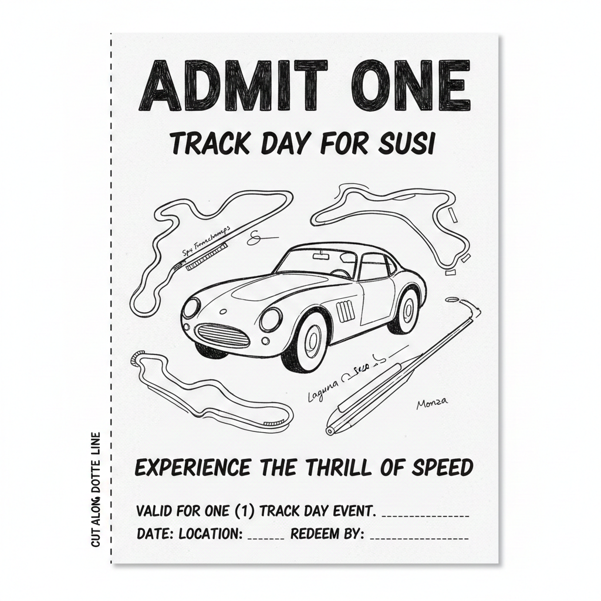
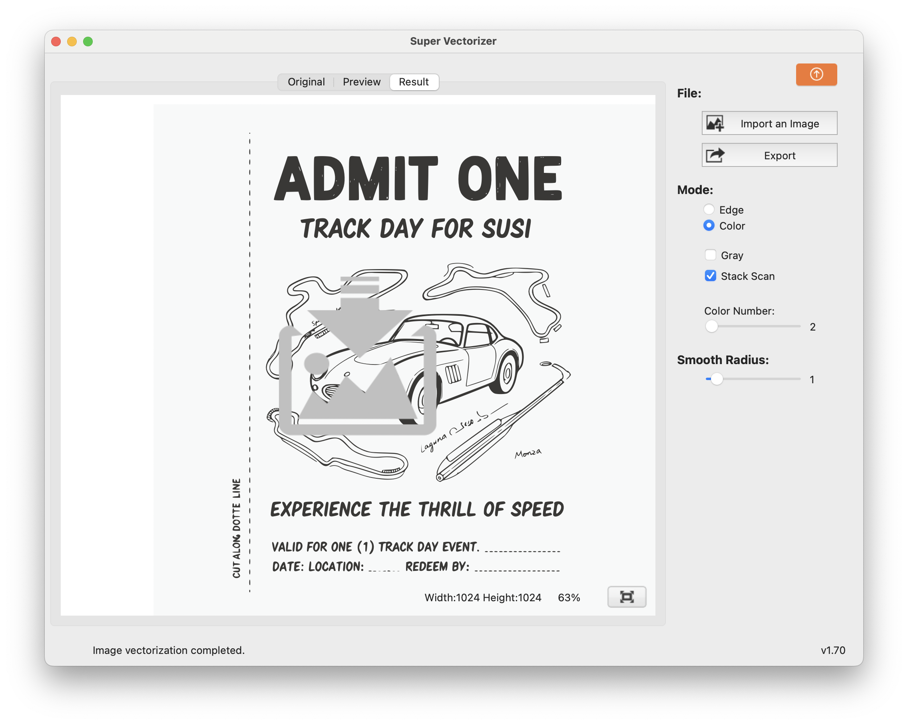
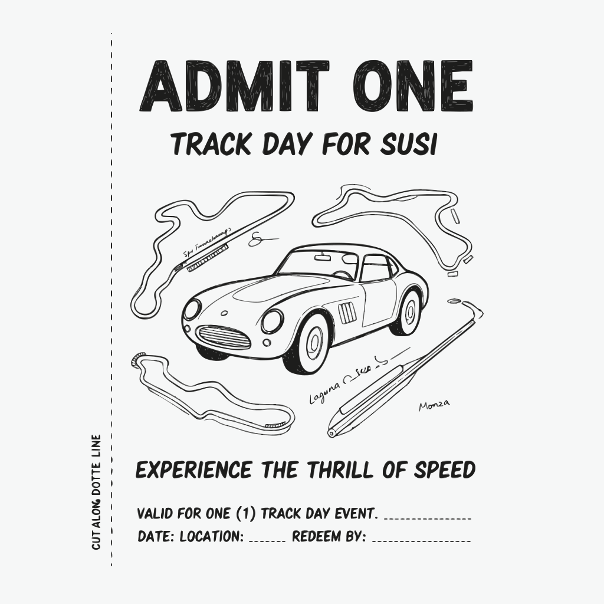

```
design a coupon for a track day for my wife Susi add some tracks and a shape of an easy car. it will be printed with a pen plotter so please keep it black and white so it can be vectorized
```
to Gemini ([session](https://gemini.google.com/share/376cbdc7ffdc))

generated this


Super Vectorizer (actual values are lost, I think it was `3` three or `4` four colors)


returned this:


removed the background and cleaned it up:

