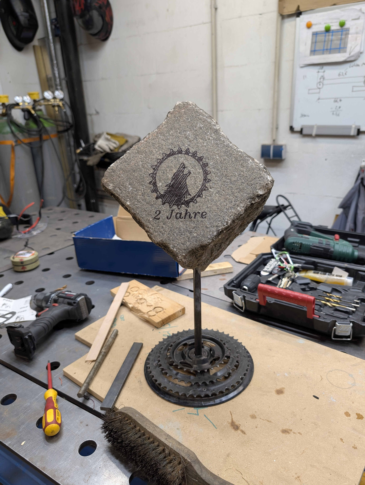

# RSV Steppenwolf feiert 2 Jahre Geburtstag

Der [Radsportverein Steppenwolf](https://steppenwolf-berlin.de/) feiert 2. Geburtstag und Falko von 35services und Daniel vom [Roter Stern Berlin e.V. (Radsportabteilung)](https://roter-stern.berlin/) haben eine Geburtstagstrophäe gebaut.

Im Ordner [input](input) sind alle verwendeten Dateien.

### TODO:
 * [ ] etwas text zu den Input Dateien schreiben

 ## Tools:
 * Super Vectorizer (Mac App Store) - Es gibt wohl nur noch die [Pro Version](https://www.svgvector.com/)
 * Vinlio (Mac) [https://apps.apple.com/de/app/vinilo-crafting/id1554518531](https://apps.apple.com/de/app/vinilo-crafting/id1554518531)
 * Axi Draw V3
 * ein "Standard Fine Tip Sharpie® Marker"

Hier das Resultat:

